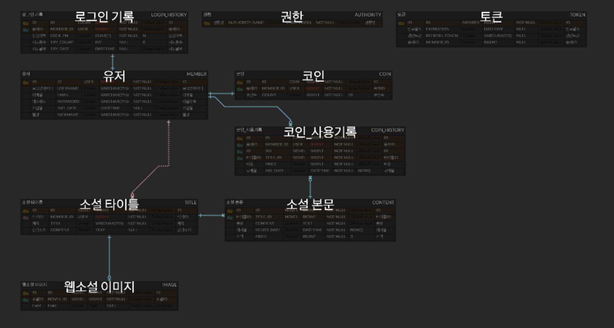

# 웹 소설 서비스

## 프로젝트 설정
1. spring boot 3.4.0
2. H2 - TEST 용

## public DNS
추후 추가 예정

[//]: # (ec2-43-201-193-154.ap-northeast-2.compute.amazonaws.com)

## 시스템 아키텍처

[//]: # (- Github Action을 통해 CI후 빌드파일 S3에 저장 $rarr; Codedeploy에 CD 요청해 S3의 빌드파일을 EC2에 배포합니다.)

[//]: # (- EC2는 NginX를 통해 가장 최근의 배포되어 실행중인 Application 서비스로 리버스 프록시됩니다.)
- Application 서비스는 Api 서비스와 Batch 서비스가 같이 실행됩니다.

[//]: # (- DB는 MariaDB RDS로 EC2서비스에서 연결되어 있습니다.)
- DB는 TEST 용으로 H2 를 로컬로 이용 중 입니다.

[//]: # (  ![img_2.png]&#40;img_2.png&#41;)

## API 목록

[//]: # (http://ec2-43-201-193-154.ap-northeast-2.compute.amazonaws.com/docs/index.html)
1. 회원가입 - docs x
    - POST /api/members - 구현중
2. 로그인  - docs x
    - POST /api/authorize
3. 토큰 재발급  - docs x
    - POST /api/authorize/reissue - 구현중
4. 웹소설 목록 조회
    - GET /api/novel
5. 웹소설 단건 조회
    - GET /api/novel/{novelId}
6. 웹소설 상세 조회
    - GET /api/novel/{novelId}/content
7. 웹소설 등록
    - POST /api/novel
8. 웹소설 수정
    - PATCH /api/novel/{novelId}
9. 웹소설 삭제
    - DELETE /api/novel/{novelId}
10. 웹소설 구매
    - POST /api/members/{userId}/novel/{novelId}
11. 웹소설 잔여 컨텐츠 모두 구매
    - POST /api/members/{userId}/novel/{novelId}/all
12. 잔여 코인 조회
    - GET /api/members/{userId}/coin
13. 코인 사용 내역 조회
    - GET /api/members/{userId}/coin/history
14. 코인 충전
    - POST /api/members/{userId}/coin
15. 회원탈퇴 - docs x
    - DELETE /api/members

## ERD

[//]: # (## DB Schema)

[//]: # (![img_1.png]&#40;img_1.png&#41;)

## 고민사항
1. Exception handling
    1. 상황에 맞는 HTTP 상태 코드와 사용자가 요청을 수정해 재시도할 수 있도록 오류 사유를 나타내는 메시지를 입력값과 함께 전달할 수 있도록 노력했습니다.
    2. Exception은 `ApplicationException - DomainException - 상황별Exception` 의 계층으로 구현해 오류시 로그에서 확인이 용이하도록 구현했습니다.
2. Entity 연관관계 설정
    1. Enum 의 값을 그대로 주입하는 @Enumerated 등을 처음 이용하여 어떻게 관리할지 궁금했습니다.
    2. 대부분의 경우는 연관관계 주인을 상위 엔티티에서 단방향으로 참조하는 형태로 해결했습니다.
    3. 이렇게 구현하고 보니, FK를 항상 하위 엔티티에서 갖고 있는 상태인데, 테스트시에 각각의 하위 엔티티를 새로 생성해줘야하다보니 굉장히 귀찮았습니다.
    4. 이를 해결하기 위해 다대다의 연관관계이며 상대적으로 많은 데이터가 발생할 경우를 예상하고 그 대상으로 중간 테이블을 두어 관리에 차별을 두려 했습니다.
3. 테스트 코드 작성과 예외 테스트
    1. TDD 기반으로 구현을 진행할 목적으로 테스트 도구를 선택하고 진행했습니다. 도구는 JUnit 으로 결정했습니다.
        1. 이유는 기존 given, when, then 형식의 테스트에 익숙하여 선택했습니다.
        2. 하지만 새로운 스킬 인벤토리의 확장을 위하여 추가적인 테스트 도구를 학습 중에 있습니다.
    2. 익숙하지 않은 기술들을 테스트를 통해 학습하려 했습니다.
        1. 각 테스트의 멱등성을 보장하기 위해, 테스트 메서드별로 독립적인 상황에서 온전한 테스트를 진행할 수 있도록 구성하려 계획했습니다.
        2. Spring Security 구현 중 Password encoder 의 역할과 UserDetailsService 의 역할과 기능을 파악하려 했습니다.
        3. 실제로 구현시에 주로 이용되는 BCrpytPasswordEncoder 의 기능을 테스트하며 CustomPasswordEncoder 를 구현했고, Security 의 동작 중 UserDetailsService 의 역할을 파악하여 재정의할 수 있게 했습니다. 
4. JWT 구현 중 DB 를 이용한 방식과 Redis 를 이용한 방식
    1. JWT 를 이용한 개발시에 항상 DB 를 이용한 점이 아쉬워서 Redis 를 학습하려 했습니다.
    2. 실제 구현 코드 리뷰 중 기능 자체의 구현은 어렵지 않은 것을 파악하여 Redis 의 특징을 확인하려 노력했습니다.
5. API 서버와 배치서버의 분리 - 멀티모듈 프로젝트
    1. API 서버와 배치 서버의 분리를 생각하고 진행하질 않아서 API 모듈 애플리케이션에서 배치 모듈까지 같이 실행하게 구현되었습니다.
6. @Embeddable 을 통한 일급컬렉션 엔티티 구성
    1. 이 부분은 리팩터링 진행을 하지 못했습니다.

[//]: # (7. git branch 전략: github flow)

[//]: # (    1. 브랜치는 각 도메인 단위로 생성해, 기능단위로 커밋하도록 노력했습니다.)

[//]: # (    2. 브랜치 관리 전략은 혼자 관리하는 프로젝트이나, PC두대에서 나눠 진행했던터라 github flow로 merge등을 좀 더 용이하게 했습니다.)
[//]: # (11. reservationExecute batch 오류)

[//]: # (    - Reservation &rarr; Account &rarr; Trades 를 참조하고 있는 관계에서,)

[//]: # (    - 첫번째는 ManyToOne / LAZY / cascade ALL)

[//]: # (    - 두번째는 OneToMany / LAZY / cascade ALL)

[//]: # (    - 위와 같이 설정했는데 배치 실행시 한번의 배치 수행시 같은 Account 에 대한 예약이 여러건이면, Account 와 Trades 의 연관관계 테이블에 마지막 반영분만 insert 된다.)

[//]: # (    - 전체 대상 select &rarr; account select &rarr; trades select &rarr; item processor 건별처리 &rarr; [reservation select 한건 &rarr; bank select 한건 &rarr; member select 한건 &rarr; trade insert 한건 &rarr; trades insert 한건 &rarr;] 반복 &rarr; account update &rarr; reservation update all &rarr; account_trades insert 1건)

[//]: # (    - 이 문제는 chunkSize를 1개로 줄이고, ItemProcessor에서 건별로 save를 하니 해결되었습니다만, 정확한 원인 파악은 못한상태라 추가적인 검증이 필요합니다.)